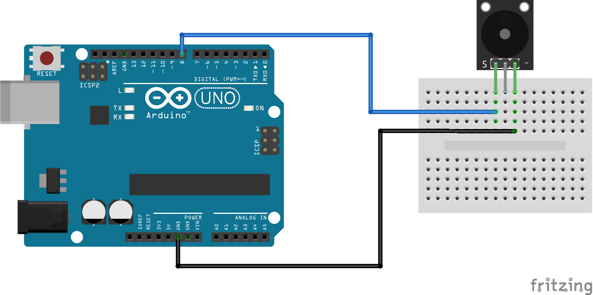
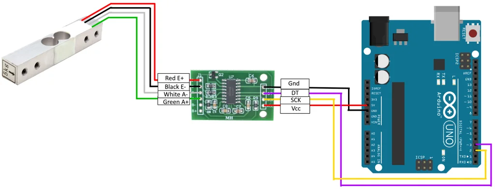
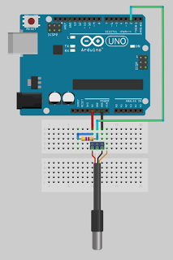

# Arduino Documentation

## Installation

For our work we used __Arduino ESP8266: WeMos-D1R2__

1. Connect Arduino to your computer
   

2. Install the drivers: can be found [here](https://sparks.gogo.co.nz/ch340.html)
   

3. Arduino Software/IDE: can be found [here](https://www.arduino.cc/en/software)

4. Configure the 3rd party library
    1. Go to `File| Preferences`
    2. In the __Additional Board Manager__ add the following
       link: `http://arduino.esp8266.com/stable/package_esp8266com_index.json`
    3. Go to `Tools | Board:… | Boards Manager`
    4. Install the `ESP8266` library
    5. Go to `Tools | Board:…` and select the __WeMos-D1R2__ mode
   

5. Install the other dependencies
   1. Install the scale library: can be found [here](https://github.com/bogde/HX711)
   2. Install the `DallasTemperature`
      1. Go to `Sketch | Include Library | Manage Libraries`
      2. Search for `DallasTemperature`
      3. Install it with all of its dependencies (OneWire)
   

6. Before starting the code, it is good idea to calibrate your scale, by changing your calibration factor
   - A guide for this can be found [here](https://www.instructables.com/Arduino-Scale-With-5kg-Load-Cell-and-HX711-Amplifi/)
   - In out case we found that we needed factor of __-1600__
   
## Schemas

Here are the schemas used for our setup.

### Buzzer 

### Scale

### Temperature sensor 

