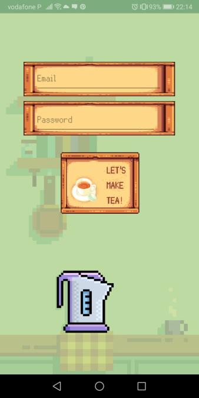
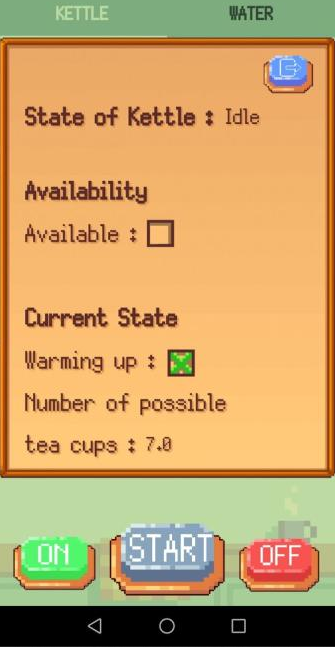
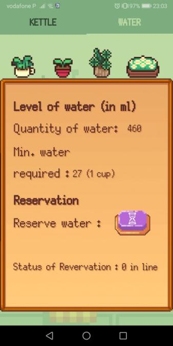

# Android Documentation (Pixel design by me)

## Functionality

### Login

Upon starting the application we can see the login page.

In order to login, you must have a user, which is created on the firebase page. The login is done via email and password.

### Kettle Tab

After login the user lands on a page with multiple tabs, the first one displays the status of the Kettle.

The kettle tab is divided in 3 parts:
- Information about the status of the kettle
- Availability of the kettle
	- Amount of water
	- How many standard (27cl) cups we can make
- Control Buttons:
  

  |Button|Functionality        |
  |------|---------------------|
  |ON    | Turns the kettle ON |
  |START | Starts brewing      |
  |OFF   | Turns the kettle OFF|

### Water Tab

This tab is used to reserve water. It is separated into 3 parts:
- Information about the water, includes:
    - Amount of water in __ml__
    - Minimum water amount for a reservation (27ml)
- Reservation - contains a purple button which opens a menu which allows us to select the amount of water we need to reserve
- How many reservations you have at the moment.

When a reservation is processed, or completed the user receives a notification.

---------------

If interested in seeing the Arduino, RaspberryPi and firebase work, you can check out the full work here https://github.com/HristoValkanov/chaleira-fcup
